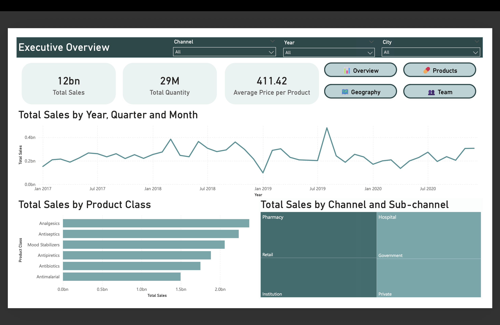

# 📊 Pharma Sales Analysis Dashboard

A comprehensive Power BI dashboard analyzing pharmaceutical sales data across distributors, products, channels, and sales teams (2017-2020). This project demonstrates advanced data analytics, interactive visualizations, and business intelligence skills.



## 🎯 Project Overview

This project was developed as part of the UIU Data Analytics Course (CDIP, United International University) to demonstrate proficiency in:

- Data cleaning and transformation using Power Query to prepare and standardize raw datasets for analysis
- Data modeling and DAX measure development in Power BI to enable accurate calculations and meaningful KPIs
- Interactive dashboard design with intuitive user navigation, filters, and drill-downs for exploratory analysis
- Business intelligence and insight generation, translating analytical findings into actionable recommendations for decision-making

**Objective:** Create an executive-level dashboard to help pharmaceutical distribution management make data-driven decisions across products, channels, geography, and sales teams.

**Key Achievement:** Analyzed **$12 billion** in sales across **28.7 million transactions** spanning 4 years.

---

## 📊 Dataset

**Source:** Pharma Sales Transaction Records (2017-2020)

**Scale:**
- **Total Sales:** $11.8 billion
- **Total Quantity:** 28.7 million units
- **Average Price:** $411.42 per unit
- **Time Period:** 4 years (2017-2020)
- **Geographic Coverage:** 50+ cities
- **Sales Force:** 13+ sales representatives across 4 teams

**Key Fields:**
- **Sales Data:** Quantity, Price, Sales Amount
- **Product Info:** Product Name, Product Class (6 categories)
- **Location:** City, Distributor
- **Channel:** Hospital, Pharmacy (with sub-channels: Retail, Institution, Government, Private)
- **Sales Team:** Sales Representative, Manager, Team (Alfa, Bravo, Charlie, Delta)
- **Time:** Year, Month, Quarter


**Data File:** Available in `/data` folder as `pharma_sales_data.zip`

**To use:**
1. Download `pharma_sales_data.zip`
2. Extract the CSV file
3. Place it in the same folder as the .pbix file
4. Open Power BI and refresh data

## ✨ Key Features

### 📈 Interactive Visualizations
- **10+ dynamic charts** responding to slicer selections
- **Time-series analysis** showing 4-year sales trends
- **Geographic mapping** of sales performance across cities
- **Correlation analysis** (Quantity vs Sales Value by Product Class)
- **Navigation buttons** for seamless page transitions

### 🔍 Filters & Slicers
- **City** - Filter by geographic location (50+ cities)
- **Channel** - Hospital vs Pharmacy
- **Year** - 2017-2020 time range
- **Synced across all pages** for consistent cross-page analysis

### 📊 Advanced Analytics
- Top 10 product rankings by sales performance
- Sales representative performance metrics and rankings
- Channel-wise monthly trends with dual-axis visualization
- Product class profitability and pricing analysis
- Team hierarchy performance matrix

---

## 📄 Dashboard Pages

### 1. 📊 Executive Overview
**Purpose:** High-level KPIs and trends for C-suite and management

**Key Metrics:**
- Total Sales: **$12bn**
- Total Quantity: **29M units**
- Average Price per Product: **$411.42**

**Visuals:**
- Monthly Sales Trend (2017-2020) - Line chart showing temporal patterns
- Sales by Product Class - Horizontal bar chart
  - Analgesics: **~$2bn** (highest)
  - Antiseptics: **~$1.8bn**
  - Mood Stabilizers: **~$1.7bn**
  - Antipiretics: **~$1.5bn**
  - Antibiotics: **~$1.4bn**
  - Antimalarial: **~$1.2bn**
- Sales by Channel & Sub-channel - Hierarchical visualization
  - Pharmacy: Retail, Institution
  - Hospital: Government, Private

**Navigation:** Buttons for Overview, Products, Geography, Team


---

### 2. 💊 Product Performance
**Purpose:** Deep dive into product-level analytics and pricing strategies

**Visuals:**

**Top 10 Products by Sales:**
1. Ionclotide - **~$200M**
2. Tetratanyl - **~$175M**
3. Sumanazole - **~$165M**
4. Betanem - **~$155M**
5. Docstryl Rivacin - **~$145M**
6. Travoloride - **~$140M**
7. Propratecan - **~$135M**
8. Ketastadil - **~$125M**
9. Nevanide Actozide - **~$120M**
10. Cephozumab Synmethate - **~$115M**

**Average Price by Product Class:**
- Consistent pricing across categories (**~$400-420** range)
- Shows standardized pricing strategy

**Sales Quantity vs Sales Value (Scatter Plot):**
- 6 product class bubbles showing correlation
- Quantity range: 4M - 5.5M units
- Sales range: $1.5bn - $2bn
- Reveals volume-value relationships by category


---

### 3. 🗺️ Geographic Analysis
**Purpose:** Regional performance insights and channel trend analysis

**Visuals:**

**Sales Performance by City (Interactive Map):**
- Bubble map showing sales distribution across 50+ cities
- Larger bubbles indicate higher sales concentration
- Geographic patterns reveal strong urban market presence

**Total Sales and Quantity by Year and Channel:**
- Dual-axis combo chart (columns + line)
- **Channel breakdown:**
  - Hospital (Blue)
  - Pharmacy (Orange)
- **Line:** Sum of Quantity trend
- **Columns:** Total Sales by year
- Shows consistent growth 2017-2020
- Peak sales: **~$2bn** in later years

**Key Insight from Chart:**
- Both channels show steady growth
- Hospital channel slight edge in later years
- Quantity trend aligns with sales growth


---

### 4. 👥 Sales Team Performance
**Purpose:** Individual and team performance metrics for HR and management

**Visuals:**

**Team Performance by Manager (Matrix):**

| Manager | Team | Total Sales | Total Quantity | Avg Price |
|---------|------|-------------|----------------|-----------|
| **James Goodwill** | Alfa | $2.58bn | 6.30M | $409.55 |
| **Tracy Banks** | Bravo | $2.76bn | 6.79M | $405.86 |
| **Alisha Cordwell** | Charlie | $2.82bn | 6.71M | $420.83 |
| **Britanny Bold** | Delta | $3.64bn | 8.87M | $409.88 |
| **Total** | | **$11.80bn** | **28.68M** | **$411.42** |

**Winner:** Delta Team (Britanny Bold) - Highest sales at **$3.64bn**

**Sales by Sales Representative (Donut Chart):**
Top performers:
1. **Jimmy Grey** - $986M (8.36%)
2. **Abigail Thompson** - $981M (8.31%)
3. **Sheila Stones** - $958M (8.12%)
4. **Daniel Gates** - $951M (8.06%)
5. **Anne Wu** - $920M (7.8%)
6. **Morris Garcia** - $901M (7.64%)
7. **Stella Given** - $888M (7.53%)
8. **Jessica Smith** - $882M (7.47%)
9. **Steve Pepple** - $875M (7.42%)
10. **Mary Gerrard** - $875M (7.42%)
11. **Erica Jones** - $871M (7.39%)
12. **Thompson Crawford** - $867M (7.35%)
13. **Alan Ray** - $843M (7.14%)

**Top 5 Sales Representative Trend (Bonus Chart):**
- Line chart showing performance trajectory 2017-2020
- Tracks: Jimmy Grey, Abigail Thompson, Sheila Stones, Daniel Gates, Anne Wu
- All show upward growth trends
- Sales range: $200M - $300M per year per rep


---

## 💡 Key Insights

### 📈 Sales Performance
- **Total Revenue:** $11.8 billion across 4 years
- **Consistent Growth:** Steady upward trend from 2017 to 2020
- **Peak Performance:** Sales reached approximately $2bn in peak quarters
- **Average Transaction Value:** $411.42 per unit

### 🏆 Top Performers

**Products:**
- **#1 Product:** Ionclotide with $200M in sales
- **Top 3 Combined:** Ionclotide, Tetratanyl, Sumanazole account for $540M+

**Sales Representatives:**
- **Top Rep:** Jimmy Grey - $986M (8.36% of total sales)
- **Performance Spread:** Top 13 reps range from $843M to $986M (relatively balanced)
- **Team Leader:** All top 5 reps show consistent growth 2017-2020

**Teams:**
- **Highest Performing Team:** Delta (Britanny Bold) - $3.64bn
- **Team Rankings:** Delta > Charlie > Bravo > Alfa
- **Delta's Edge:** 31% of total company sales

### 🏥 Channel Analysis
- **Two Primary Channels:** Hospital and Pharmacy
- **Sub-channels:** 
  - Pharmacy: Retail, Institution
  - Hospital: Government, Private
- **Growth Pattern:** Both channels show parallel growth trends
- **Market Balance:** Relatively even distribution between channels
- **Strategic Insight:** Dual-channel strategy working effectively

### 💊 Product Strategy
- **6 Product Classes:** All performing in $1.2bn - $2bn range
- **Leader:** Analgesics at ~$2bn (highest revenue generator)
- **Price Consistency:** All classes maintain $400-420 average price
- **Volume Correlation:** Strong positive correlation between quantity and sales value
- **Portfolio Balance:** No single class dominates; diversified revenue streams

### 🗺️ Geographic Insights
- **Coverage:** 50+ cities nationwide
- **Urban Concentration:** Larger bubbles indicate strong metropolitan presence
- **Growth Opportunity:** Smaller cities show potential for expansion
- **Distribution:** Wide geographic spread suggests strong market penetration

---

## 🔧 Technical Details

### Data Cleaning (Power Query)
```
✅ Removed null values and duplicate transaction records
✅ Standardized data types (Quantity: Whole Number, Price: Decimal, Sales: Currency)
✅ Created Date column from Year + Month fields
✅ Validated and standardized City names for accurate geographic mapping
✅ Cleaned Product Name and Sales Representative name fields
✅ Established data type consistency across all columns
```

### Data Modeling
```
✅ Created star schema with fact and dimension tables
✅ Established relationships between:
   - Sales Fact Table
   - Product Dimension
   - Location Dimension
   - Sales Team Dimension
   - Date Dimension
✅ Optimized for query performance with proper indexing
```

### DAX Measures Created
```dax
// Total Sales
Total Sales = SUM('SalesData'[Sales])

// Total Quantity
Total Quantity = SUM('SalesData'[Quantity])

// Average Price per Product
Average Price per Product = 
    DIVIDE(
        SUM('SalesData'[Sales]), 
        SUM('SalesData'[Quantity]), 
        0
    )

// Date Column (if needed)
Date = DATE('SalesData'[Year], 'SalesData'[Month], 1)

// Sum of Quantity (for visualizations)
Sum of Quantity = SUM('SalesData'[Quantity])
```

### Navigation Implementation
```
✅ Custom navigation buttons on Page 1 (Executive Overview)
✅ Button actions configured for page navigation
✅ Icons used: 📊 Overview, 💊 Products, 🗺️ Geography, 👥 Team
✅ Consistent placement for intuitive user experience
```

---

## 🛠️ Tools & Technologies

| Tool | Purpose | Version |
|------|---------|---------|
| **Microsoft Power BI Desktop** | Dashboard development & visualization | Latest (2024-2025) |
| **Power Query** | Data cleaning & ETL processes | Built-in |
| **DAX (Data Analysis Expressions)** | Calculated measures & KPIs | Latest |
| **Power BI Service** | Publishing & sharing (optional) | Cloud-based |

---

## 🚀 How to Use

### Prerequisites
- **Microsoft Power BI Desktop** (Free download: [powerbi.microsoft.com](https://powerbi.microsoft.com))
- **Windows 10/11** or compatible operating system
- Minimum **4GB RAM** recommended for smooth performance

### Installation Steps

1. **Clone this repository:**
```bash
   git clone https://github.com/[YourUsername]/Pharma-Sales-PowerBI-Dashboard.git
```

2. **Navigate to the project folder:**
```bash
   cd Pharma-Sales-PowerBI-Dashboard
```

3. **Open the Power BI file:**
   - Go to `report/` folder
   - Double-click `Pharma_Sales_Dashboard.pbix`
   - Power BI Desktop will launch automatically

4. **Explore the dashboard:**
   - Use **navigation buttons** on Executive Overview page, OR
   - Click **page tabs** at the bottom
   - Apply **slicers** (City, Channel, Year) to filter data
   - Hover over visuals for detailed tooltips

### Interacting with the Dashboard

**Navigation:**
- Click buttons: 📊 Overview | 💊 Products | 🗺️ Geography | 👥 Team
- OR use page tabs at bottom of screen

**Filters:**
- **City Slicer:** Select single or multiple cities
- **Channel Slicer:** Choose Hospital, Pharmacy, or both
- **Year Slicer:** Filter by 2017, 2018, 2019, 2020, or all years

**Visuals:**
- **Click** on chart elements to cross-filter other visuals
- **Hover** for detailed data points and tooltips
- **Right-click** on visuals for export and drill-down options
- **Zoom** on scatter plot for detailed analysis

---

## 📁 Project Structure
```
Pharma-Sales-PowerBI-Dashboard/
│
├── data/
│   └── pharma_sales_data.csv          # Raw sales transaction data
│
├── screenshots/
│   ├── page1_executive_overview.png   # Dashboard page previews
│   ├── page2_product_performance.png
│   ├── page3_geographic_analysis.png
│   └── page4_team_performance.png
│
├── report/
│   └── Pharma_Sales_Dashboard.pbix    # Complete Power BI dashboard file
│
├── .gitignore                          # Git ignore file for temp files
├── LICENSE                             # MIT License
└── README.md                           # This file - project documentation
```

---

## 📊 Dashboard Specifications

| Metric | Value |
|--------|-------|
| **Pages** | 4 (Executive, Product, Geographic, Team) |
| **Visualizations** | 11 (including navigation buttons) |
| **Slicers** | 3 (City, Channel, Year) - synced across pages |
| **DAX Measures** | 4+ custom measures |
| **Data Points** | 28.7M+ transactions |
| **Time Period** | 2017-2020 (4 years) |
| **Revenue Analyzed** | $11.8 billion |
| **Product Classes** | 6 categories |
| **Sales Teams** | 4 (Alfa, Bravo, Charlie, Delta) |
| **Sales Reps Tracked** | 13 individuals |

---

## 🎓 Learning Outcomes

Through this project, I developed comprehensive skills in:

### ✅ Data Preparation & ETL
- Cleaning large-scale datasets (28M+ rows)
- Handling null values, duplicates, and data inconsistencies
- Data type standardization and validation
- Creating derived columns (Date from Year/Month)

### ✅ Data Modeling
- Designing star schema architecture
- Creating relationships between fact and dimension tables
- Optimizing data models for performance
- Understanding cardinality and filter direction

### ✅ DAX (Data Analysis Expressions)
- Writing calculated measures (Total Sales, Avg Price)
- Using aggregation functions (SUM, DIVIDE)
- Error handling in formulas
- Creating dynamic KPIs

### ✅ Visualization Design
- Selecting appropriate chart types for different data
- Color theory and consistent theming
- Layout and whitespace management
- User experience (UX) principles

### ✅ Business Intelligence
- Translating business questions into analytics
- Creating actionable, executive-level insights
- Dashboard navigation and user flow
- Cross-filtering and interactivity

### ✅ Presentation & Communication
- Structuring multi-page dashboards
- Creating clear, self-explanatory visuals
- Balancing detail with simplicity
- Professional design aesthetics

---

## 🔮 Future Enhancements

Potential improvements for Version 2.0:

- [ ] **Predictive Analytics** - Add sales forecasting using Power BI's AI features
- [ ] **Drill-Through Pages** - Create detailed product and city-level deep dives
- [ ] **Mobile Layout** - Optimize dashboard for phone/tablet viewing
- [ ] **Bookmarks** - Add saved views for different stakeholder personas
- [ ] **Real-Time Data** - Connect to live data source via DirectQuery
- [ ] **Q&A Visual** - Implement natural language query interface
- [ ] **Alerts** - Set up automated notifications for KPI thresholds
- [ ] **Row-Level Security** - Implement RLS for manager-specific views
- [ ] **Performance Scorecards** - Add year-over-year comparison metrics
- [ ] **What-If Parameters** - Create scenario analysis tools

---

## 👨‍💻 Author

**Zareen Shyma**
- 📧 Email: mithizs08@gmail.com
- 💼 LinkedIn: [https://www.linkedin.com/in/zareen-shyma/](https://www.linkedin.com/in/zareen-shyma/)
- 💻 GitHub: [github.com/mithizs08](https://github.com/mithizs08)

### Skills Demonstrated
`Power BI` `DAX` `Power Query` `Data Modeling` `ETL` `Business Intelligence` `Data Visualization` `SQL` `Dashboard Design` `Analytics`

---


## 🙏 Acknowledgments

- **UIU Data Analytics Course** for the comprehensive project assignment and learning framework
- **Power BI Community** for inspiration and best practices
- **Microsoft Learn** for Power BI documentation and tutorials
- **Dataset Contributors** for providing realistic pharmaceutical sales data

---

## 📞 Contact & Feedback

Questions, suggestions, or collaboration opportunities?

- 📧 Email me at: mithizs08@gmail.com
- 💼 Connect on LinkedIn: [Zareen Shyma](https://www.linkedin.com/in/zareen-shyma/)
- 🐛 Report issues: [GitHub Issues](https://github.com/[mithizs08]/pharma-sales-powerbi-dashboard/issues)
- ⭐ **If you found this project helpful, please give it a star!**

---

**Project Status:** ✅ Complete | **Last Updated:** January 2025

---

### 🎯 Quick Access

- 📂 [View Dashboard File](report/Pharma_Sales_Dashboard.pbix)
- 📊 [Download Dataset](data/)
- 📸 [View All Screenshots](screenshots/)
- 📝 [Report Issues](https://github.com/[YourUsername]/pharma-sales-powerbi-dashboard/issues)

---

<div align="center">

**Built with 💙 using Microsoft Power BI**

*Transforming data into actionable business insights*

</div>
